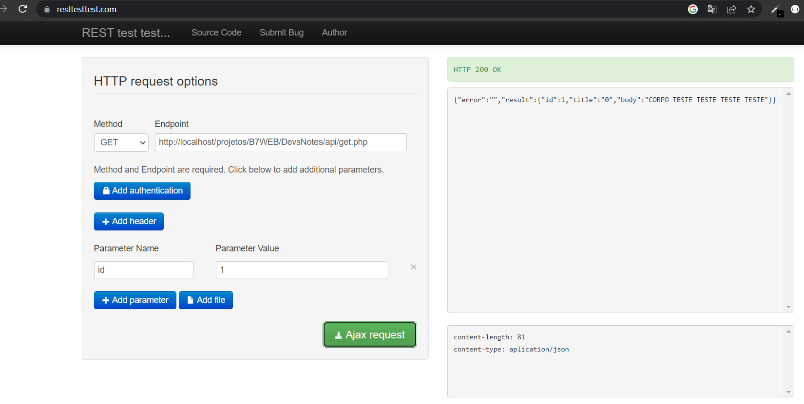
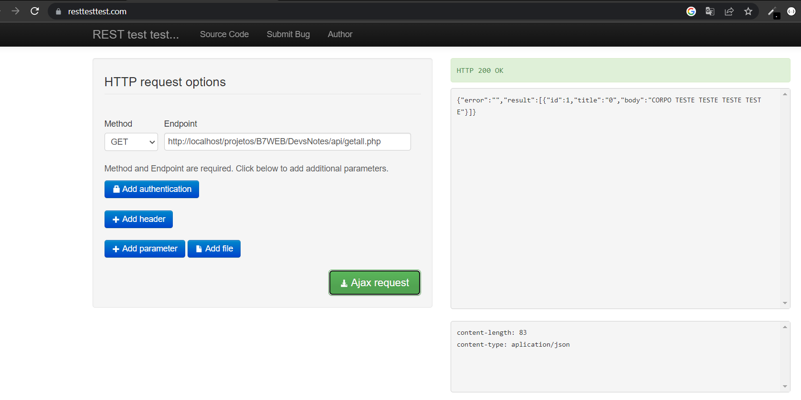
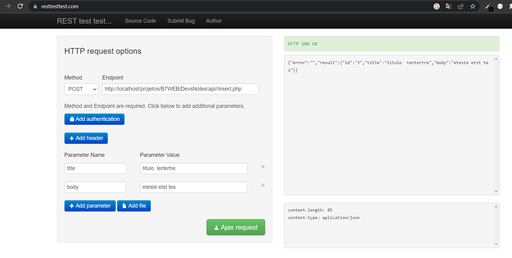
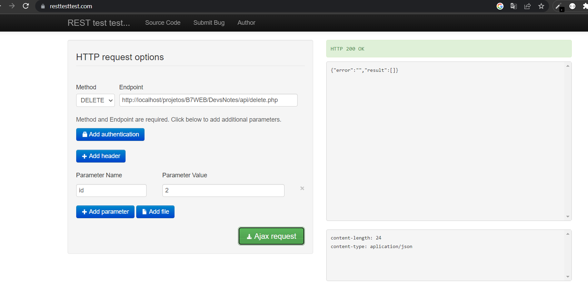
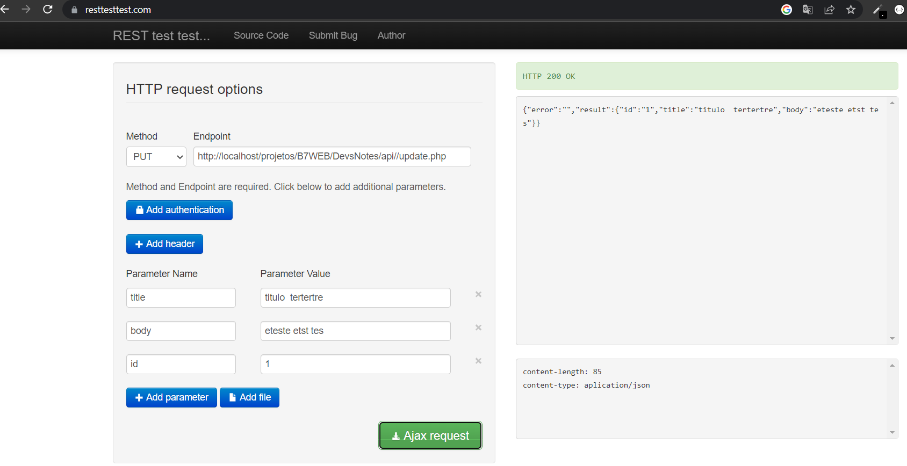

# API SIMPLES DE BLOCO DE NOTAS
Com ela pode fazer as operações básicas de um crud via API.Usei o site https://resttesttest.com/ para verificar se estava realmente funcionando

# GET

# GET ALL

# POST

# DELETE

# UPDATE
